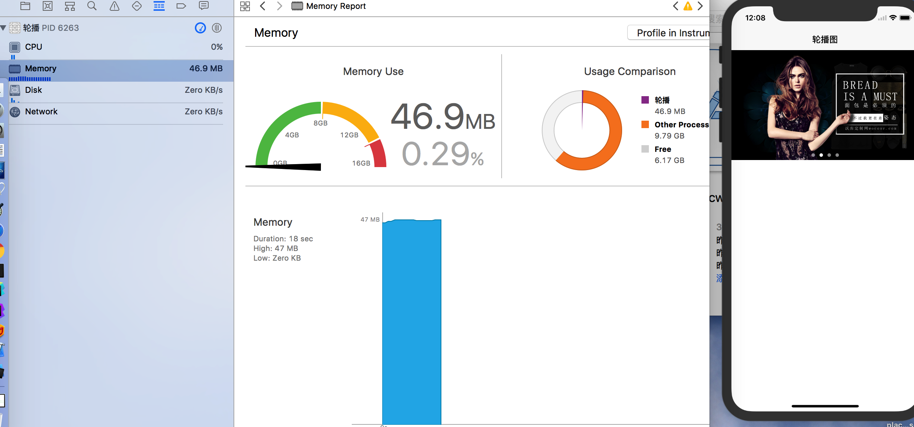
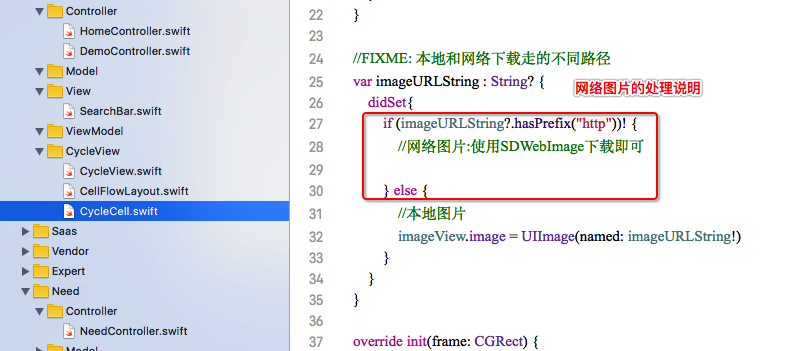

# ZYCycleView-

`QQ: 1512450002@qq.com`
`欢迎沟通交流`

ZYCycleView(图片轮播器)

* 几行代码搞定图片轮播器
* CollectionView复用cell的机制,不管当前的section有道少了item,当cell的宽和屏幕的宽一致是,当前屏幕最多显示两个cell(图片切换时是两个cell),切换完成时有且仅有一个cell,即使放大1000倍,内存中最多加载两个cell,所以不会造成内存暴涨现象

``` Swift版

//轮播图加载
let pointY = 44 + UIApplication.shared.statusBarFrame.size.height
let cycleView : CycleView = CycleView(frame: CGRect(x: 0, y: pointY, width: UIScreen.main.bounds.size.width, height: 220))

cycleView.mode = .scaleAspectFill
//本地图片测试--加载网络图片,请用第三方库如SDWebImage等
cycleView.imageURLStringArr = ["banner01.jpg", "banner02.jpg", "banner03.jpg", "banner04.jpg"]
tableView.tableHeaderView = cycleView
```
## 增加了代理方法

``` 代理方法 CycleViewDelegate
//MARK: CycleViewDelegate
extension HomeController {
    func cycleViewDidSelectedItemAtIndex(_ index: NSInteger) {
        let demoVc = DemoController()
        demoVc.title = "点击了轮播图第\(index)个图片"
        demoVc.view.backgroundColor = UIColor.white
        navigationController?.pushViewController(demoVc, animated: true)
    }
}
```


## Objective-C版

 - [ZYCycleView(图片轮播器)](https://github.com/ios-zhouyu/ZYCycleView-.git)

## 效果图

<p align="center" >

</p>

<p align="center" >

</p>

<p align="center" >

</p>

<p align="center" >

</p>
